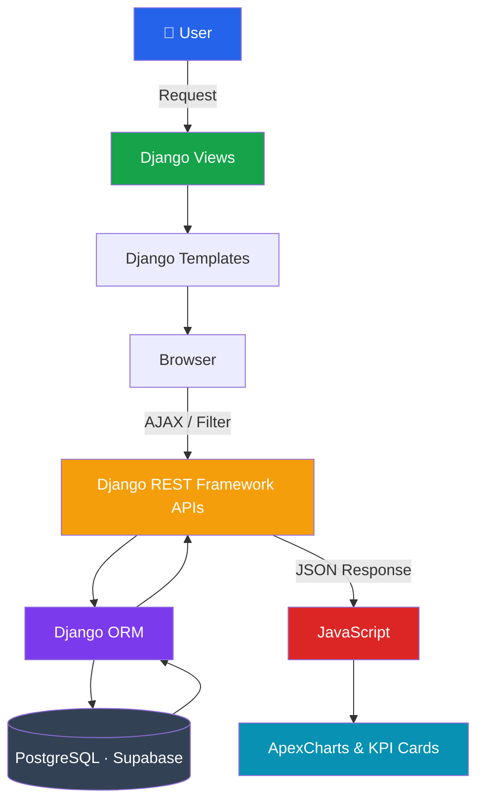
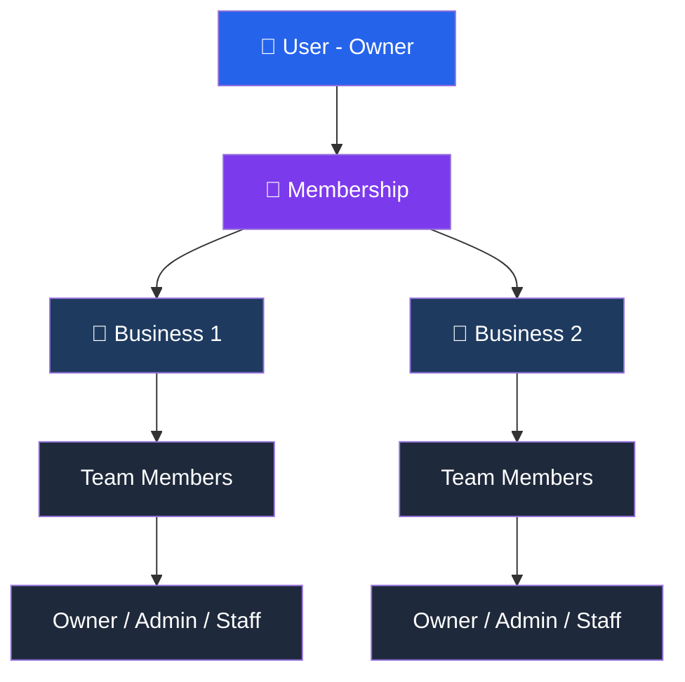
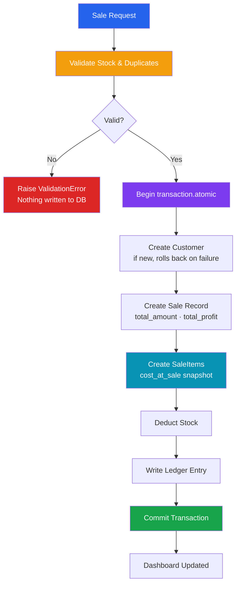
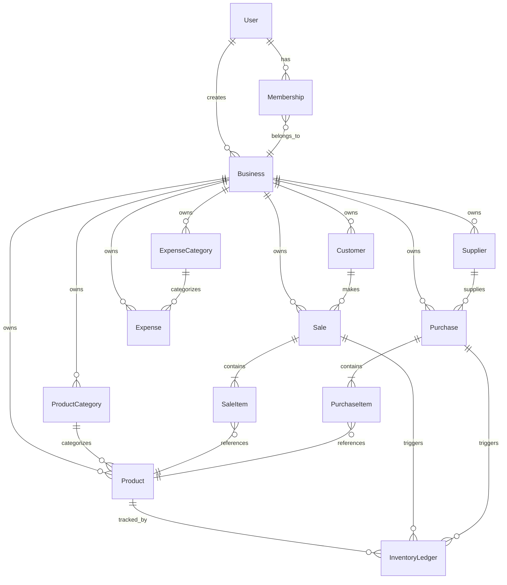

# BizMetric

**Business Management & Sales Analytics Platform**


BizMetric is a full-stack business management platform that centralizes sales, inventory, purchases, expenses, and analytics across multiple businesses. Built with production-inspired architecture and real backend business logic behind every operation.

**[Live Demo](https://bizmetric.co.in)** · **[Video Showcase](#)**

> 🌐 Live at **[bizmetric.co.in](https://bizmetric.co.in)**

---

<!-- 📸 SCREENSHOT: Add a full dashboard screenshot here (1920×1080 recommended) -->

---

## Architecture

BizMetric uses a **hybrid rendering architecture**. It's not a traditional Django monolith, and not a full SPA either.

- **Initial page load** → Django Views → Django Templates (fast, clean routing)
- **Dynamic updates** → JavaScript → DRF APIs → PostgreSQL → ApexCharts (no page reload)

This approach keeps the backend clean and the dashboard fully interactive without the overhead of a full SPA.



---

## Multi-Business Architecture

One account manages multiple businesses. Every business has completely isolated data. Products, sales, purchases, and expenses never cross between them.



> **Three roles:** Owner has full access. Admin manages operations. Staff has restricted access.

Every database query carries `business_id` context. Isolation is structural, not a conditional check.

```python
# Every query scoped to the active business
Sale.objects.filter(business_id=request.session.get("business_id"))
Product.objects.filter(business_id=request.session.get("business_id"))
```

---

## Features

### 📊 Dashboard
- Real-time KPIs: Revenue, Expenses, Net Profit, Total Sales
- Monthly revenue and expense trends via ApexCharts
- Low stock alerts and top product performance
- Fully dynamic, updates via DRF APIs without page reload

### 📦 Inventory
- Product catalog with SKU management and categories
- Stock level tracking with reorder alerts
- Weighted average cost recalculated automatically on every purchase

### 🧾 Sales
- Multi-item sale creation with inline customer search
- Automatic stock deduction and item-level profit tracking
- Full audit ledger on every transaction

### 🛒 Purchases
- Supplier-linked purchase entries
- Automatic inventory replenishment on purchase save

### 💸 Expenses & Customers
- Categorized expense logging
- Customer profiles with purchase history

### 📈 Reports
- Sales · Product Performance · Revenue vs Expenses · Inventory Health
- Interactive date filters with summary cards and ApexCharts visualizations

<!-- 📸 SCREENSHOT: Add reports page with filters applied here -->

---

## Backend Engineering

This section covers the decisions that go beyond standard CRUD.

### Sale Transaction Workflow

Every sale triggers multiple coordinated operations inside a single atomic transaction. Validation runs before anything touches the database.



**Key decisions:**

| Decision | Why It Matters |
|---|---|
| `transaction.atomic()` | Customer, sale, line items, ledger, and stock deduction all commit together, or nothing does |
| `cost_at_sale` snapshot | Profit reports stay accurate even when product prices change later |
| Stock Ledger | Every movement, whether a sale or cancellation, writes a ledger entry in both directions |

<!-- 📸 SCREENSHOT (optional): Sale creation form showing multi-item workflow -->

### Sale Cancellation Workflow

Sale cancellation reverses the original transaction by restoring inventory, preserving historical costs, updating the inventory ledger, and marking the sale as cancelled.

```python
def cancel_sale(request, sale_id, business_id):
    sale = Sale.objects.get(business_id=business_id, id=sale_id)

    if sale.is_cancelled():            # Guard — prevents double cancellation
        messages.info(request, "This sale is already cancelled")
        return

    for item in sale.items.all():
        product = item.product

        product.current_stock += item.quantity
        product.save()

        create_cancel_sale_ledger(
            business_id, sale, product,
            item.quantity, item.cost_at_sale       # Original cost preserved
      )

    sale.status = Sale.StatusChoices.CANCELLED
    sale.save()
```

### Role-Based Permissions

Permissions are enforced at the view layer via a reusable `RoleRequiredMixin`, not hidden in templates. Critical operations like cancelling a sale are restricted to Owner and Admin roles. Even direct backend requests are rejected.

```python
class CancelSaleView(RoleRequiredMixin, View):
    allowed_roles = [Membership.UserRoleChoices.OWNER,
                     Membership.UserRoleChoices.ADMIN]
    # Staff users → blocked server-side
    # UI bypass → still rejected

    permission_denied_url = "sale_detail"

    def post(self, request, pk):
        services.cancel_sale(request, pk, request.session.get("business_id"))

        return redirect("sale_detail", pk)
```

### Analytics Queries

Dashboard and report analytics are generated using Django ORM aggregations, allowing complex business metrics to be calculated directly by PostgreSQL without writing raw SQL.

```python
def get_summary(sales):
    return sales.aggregate(
        total_revenue=Sum("total_amount"),
        total_sales_count=Count("id"),
        total_profit=Sum("total_profit"),
        avg_order_value=Avg("total_amount")
    )


def get_sales_trend(sales):
    monthly_sales = (
        sales.annotate(month=TruncMonth("sale_date"))
             .values("month")
             .annotate(total_amount=Sum("total_amount"))
             .order_by("month")
    )
```

---

## Database Design



---

## Getting Started

### Prerequisites

- Python 3.10+
- PostgreSQL
- pip

### Installation

```bash
# Clone the repository
git clone https://github.com/yourusername/bizmetric.git
cd bizmetric

# Create virtual environment
python -m venv venv
source venv/bin/activate       # Windows: venv\Scripts\activate

# Install dependencies
pip install -r requirements.txt

# Configure environment
cp .env.example .env
# Set DATABASE_URL and SECRET_KEY in .env

# Run migrations
python manage.py migrate

# Seed demo data
python manage.py seed_data

# Start server
python manage.py runserver
```

### Demo Data

The project includes a custom management commands that seeds realistic businesses with interconnected sales, purchases, inventory, and expenses. The dashboard and reports are immediately usable after running it.

```bash

python manage.py seed_b1_data   # TechZone Electronics
python manage.py seed_b2_data   # FreshMart Grocery
```

---

## Project Structure

```
sales_analytics/
├── accounts/            # Authentication, custom User model
├── assets/              # Raw static source files
├── business/            # Business management, switching
├── core/                # Shared utilities, base mixins
├── dashboard/           # KPIs, DRF APIs, ApexCharts data
├── finance/             # Expenses, expense categories
├── inventory/           # Products, categories, stock ledger
├── purchases/           # Purchase workflow, suppliers
├── reports/             # Report generation, filters, analytics
├── sales/               # Sale workflow, customers, SaleItems
├── sales_analytics/     # Django project config (settings, urls)
├── static/              # Static source files
├── staticfiles/         # Collected static files
├── templates/           # HTML templates
├── users/               # User profile management
├── .env                 # Environment variables
├── build.sh             # Render build script
├── manage.py
├── render.yaml          # Render deployment config
└── requirements.txt
```

---

## Deployment

| Service | Purpose |
|---|---|
| Render | Application hosting |
| Supabase | PostgreSQL database |

---

## Author

**Abhishek Chaudhary**
Backend Developer · Python · Django · PostgreSQL

[](#)
[](#)
[](#)

---

*Built as a portfolio project demonstrating production-inspired Django development.*
